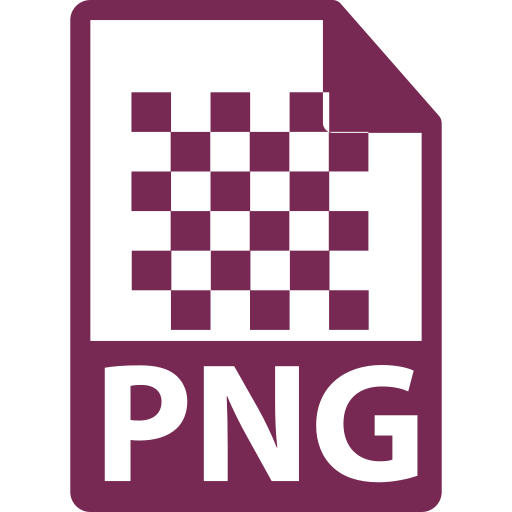
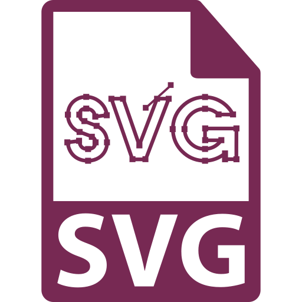

**Images** are the media lifeblood of web design. Sites can contain many images in different file types, and how that image will be used dictates what file type it should be, and vice versa.

  

    
    image.jpg
  

  

    <h4>Joint Photographic Experts Group (<b>JPEG</b> or <b>JPG</b>)</h4>
    
The JPEG is the most-utilized image format in digital publishing. JPEGs can be compressed to low-, medium, and high-quality and, because of this, can showcase images on screens at relatively small file sizes without sacrificing the integrity of the image. File types like JPG, PNG, and GIF are “rastered” and have defined dimensions. This means the image will lose quality when resized, and should not be manipulated beyond its original dimensions (width and height).

    <h4>Pros and Cons of Use:</h4>
    <ul style="list-style-type: none">
      <li class="icon-pro">Good for photographs, artwork, or other detailed images.</li>
        <li class="icon-pro">When the image has many colors.</li>
        <li class="icon-pro">Medium to small file size.</li>
        <li class="icon-con">Rastered file.</li>
    </ul>
  

  

    
    image.png
  

  

    <h4>Portable Network Graphics (<b>PNG</b>)</h4>
    
PNGs allow for transparency, an important tool in graphic and web design. Unlike JPGs, there is no compression with PNGs; these files will not lose quality when saved. However, this means PNGs are a rather large file type, and should be used sparingly or on small images.

    <h4>Pros and Cons of Use:</h4>
    <ul style="list-style-type: none">
      <li class="icon-pro">Good for graphics like logos and icons.</li>
      <li class="icon-pro">When the image has areas of full- or partial-transparency (like drop shadows).</li>
      <li class="icon-con">Large file size.</li>
      <li class="icon-con">Rastered file.</li>
    </ul>
  

  

    
    image.gif
  

  

    <h4>Graphics Interchange Format (<b>GIF</b>)</h4>
    
Similar to PNGs, GIFs have certain properties that allow for image effects. This format is most-often attributed to animated files, as it allows for several consecutive frames to be included in a single image file. Due to this, GIFs can be quite large, and may require heavy compression to be feasible in site design.

    <h4>Pros and Cons of Use:</h4>
    <ul style="list-style-type: none">
      <li class="icon-pro">Required for animated images.</li>
      <li class="icon-pro">Good for simple icons with low-color density (few colors).</li>
      <li class="icon-con">Large file size.</li>
      <li class="icon-con">Rastered file.</li>
    </ul>
  

  

    
    image.svg
  

  

    <h4>Scalable Vector Graphics (<b>SVG</b>)</h4>
    
SVGs are an integral component of web design. SVGs, as stated in their name, are scaleable and can be manipulated and styled without sacrificing quality or file size. SVGs are, in effect, “drawn” by the browser in that they are actually packets of coordinates written in a markup language (XML, or Extensible Markup Language). This code is editable, and SVGs can have colors, effects, and animations applied to them.

    <h4>Pros and Cons of Use:</h4>
    <ul style="list-style-type: none">
      <li class="icon-pro">Good for vector graphics like logos and icons.</li>
      <li class="icon-pro">Resolution-independent.</li>
      <li class="icon-pro">Manipulating does not change file size.</li>
      <li class="icon-con">Not good for detailed images, or beyond 2D needs.</li>
      <li class="icon-con">Requires an understanding on how to properly use and implement the code.</li>
    </ul>
  

