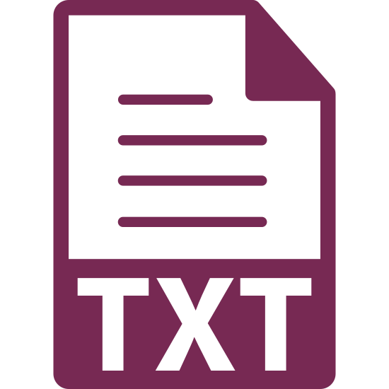

**Text documents** include many file types and can be described as any file that stores an ASCII character set (as opposed to binary data), which is the most common format for the English language.

  

    
    file.txt
  

  

    <h4>Text (<b>TXT</b>)</h4>
    
Plain text files are the simplest way of creating and storing information. Everything is stored as text, even numeric values. This is great for lightweight documentation, but excludes the use of rich content, like style or images.

    <h4>Pros and Cons of Use:</h4>
    <ul style="list-style-type: none">
      <li class="icon-pro">Widely available.</li>
      <li class="icon-pro">Flexible format; do not need special software to open.</li>
      <li class="icon-pro">Content will always look the same.</li>
      <li class="icon-con">Extremely simple; does not allow for styling, only text characters.</li>
    </ul>
  

  

    
    file.md
  

  

    <h4>Markdown (<b>MD</b>)</h4>
    
Markdown is a text-to-HTML conversion tool for web writers. Markdown allows you to write using an easy-to-read, easy-to-write plain text format, then convert it to structurally valid XHTML (or HTML). This means that Markdown files write quickly, and render stylistically with no additional directions from the writer.

    <h4>Pros and Cons of Use:</h4>
    <ul style="list-style-type: none">
      <li class="icon-pro">Has simply syntax; easy-to-learn and implement.</li>
      <li class="icon-pro">More intuitive than HTML.</li>
      <li class="icon-pro">Can be written quickly, providing formatting without interrupting workflow.</li>
      <li class="icon-con">Not a standardized markup language, meaning it may not look the same on all browsers.</li>
      <li class="icon-con">Limited styling.</li>
    </ul>
  

