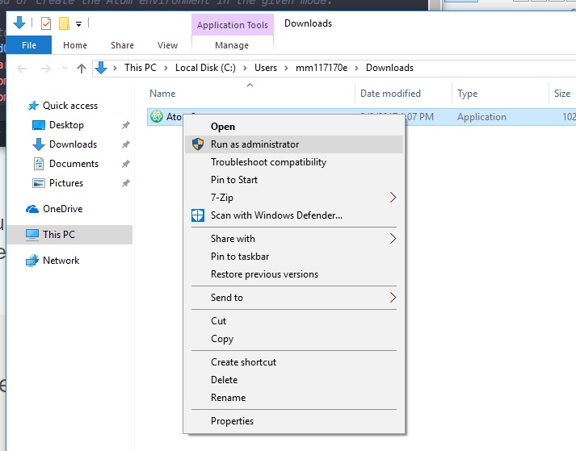

Text editors are specialty applications which can ease the type of text and coding work you will be doing in web development. These applications are designed to speed up the writing process and are specially equipped to display text documents in a way that makes identifying errors more easy.

There are many types of text editors, each optimized for specific types of tasks.

For this class, we need a text editor that is optimized for web development and code. You are welcome to use whatever text editor you like for this course, however, we will be using GitHub's open-source <a href="https://atom.io" target="_blank">Atom Editor</a> for our videos and tutorials, and it may behoove you to use it as well (especially beginners).

The following pages will guide you through the installation process.

Please following the appropriate instructions for your device.

## For Mac
<ul class="nav nav-tabs">
  <li class="active"><a href="#step1-1" data-toggle="tab">Step 1</a></li>
  <li><a href="#step2-1" data-toggle="tab">Step 2</a></li>
</ul>

  

    
Step 1: Download the software from the main <a href="https://atom.io" target="_blank">atom.io</a> site.
    

  

  

    
Step 2: Then drag the application that was downloaded from the Downloads folder to the Applications folder.

    
  

## For PC
<ul class="nav nav-tabs">
  <li class="active"><a href="#step1-2" data-toggle="tab">Step 1</a></li>
  <li><a href="#step2-2" data-toggle="tab">Step 2</a></li>
  <li><a href="#step3-2" data-toggle="tab">Step 3</a></li>
</ul>

  

    
Step 1: Download the software from the main <a href="https://atom.io" target="_blank">atom.io</a> site.

    
Important Do <u>not</u> immediately open you download. Move on to Step 2 first.

  

  

    
Step 2: When the download finishes, <b>do not simply double-click from the bottom of the browser window</b>. Instead, you first need to open the file in explorer.

    
To do this you can either open explorer and navigate to the folder where it downloaded (likely "Downloads") <em>OR</em> right-click or two-finger-click the file from the browser and select "Show in Folder."

    
Important Do <u>not</u> immediately open you download. Move on to Step 3 first.

    
  

  

    
Step 3:  From the explorer you then need to right-click the file and select <em>"Run as Administrator."</em> This is especially important if you are not sure whether you are signed in as an admin.

    
  

## Optional/Recommended Additions
Most text editors allow you to download additional packages created by the community which extend their functionality and can make them more suited to your particular needs. For Atom and this course, these would be very beneficial:

### Theme
**Themes** customize the look and feel of the editor.

<ul class="nav nav-tabs">
  <li class="active"><a href="#step1-1" data-toggle="tab">Step 1</a></li>
  <li><a href="#step2-1" data-toggle="tab">Step 2</a></li>
  <li><a href="#step3-1" data-toggle="tab">Step 3</a></li>
  <li><a href="#step4-1" data-toggle="tab">Step 4</a></li>
  <li><a href="#step5-1" data-toggle="tab">Step 5</a></li>
</ul>

  

    
Step 1: Navigate to the "Atom" main menu > Preferences... > Install.

  

  

    
Step 2: To the right of the search bar, select "Themes."

  

  

    
Step 3: Search for the <b>"newbound-dark-syntax"</b> theme. Install.

  

  

    
Step 4: Navigate to "Themes" on the side menu.

  

  

    
Step 5: Select "newbound-dark-syntax" as your “Syntax Theme."

    
    
"Newbound-dark-syntax" provides colorization for a number of languages, including markdown.

  

### Packages
**Packages** add functionality to your editor.

<ul class="nav nav-tabs">
  <li class="active"><a href="#step1-2" data-toggle="tab">Step 1</a></li>
  <li><a href="#step2-2" data-toggle="tab">Step 2</a></li>
  <li><a href="#step3-2" data-toggle="tab">Step 3</a></li>
</ul>

  

    
Step 1: Navigate to the "Atom" main menu > Preferences... > Install.

  

  

    
Step 2: Search for these packages. Install if you're interested.

    <ul>
      <li><i>markdown-preview</i> - Preview how your markdown files will look.</li>
      <li><i>open-in-browser</i> - Opens applicable files in a browser window.</li>
      <li><i>highlight-selected</i> - Highlights all occurrences of a selected word. This is useful for debugging.</li>
      <li><i>fonts</i> - Many fonts that can easily be selected for use in Atom.</li>
      <li><i>file-icons</i> - Displays file type icons next to files in the sidebar.</li>
      <li><i>language-markdown</i> - Adds syntax support to themes without markdown syntax.</li>
      <li><i>todo-show</i> - Tools for showing “TODO”-s in code.</li>
      <li><i>base linter</i> - Base package to show code errors. Couple with <i>linter-htmlhint</i> and <i>linter-stylelint</i></li>
      <li><i>open-recent</i> - Adds “open recent” functionality to the File menu in Atom.</li>
      <li><i>pigments</i> - Highlights color values in files.</li>
    </ul>
  

  

    
More interesting packages can be found on the <a href="https://scotch.io/bar-talk/best-of-atom-features-plugins-acting-like-sublime-text">scotch websites discussion of Atom</a> if you're interested.

  

