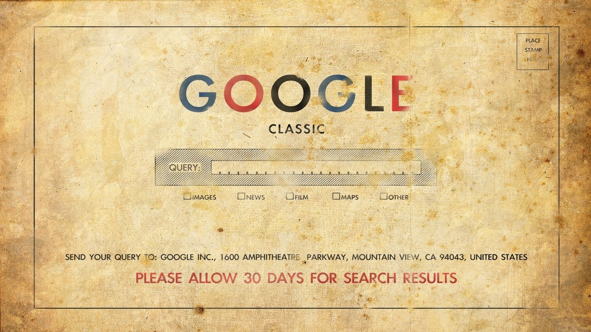
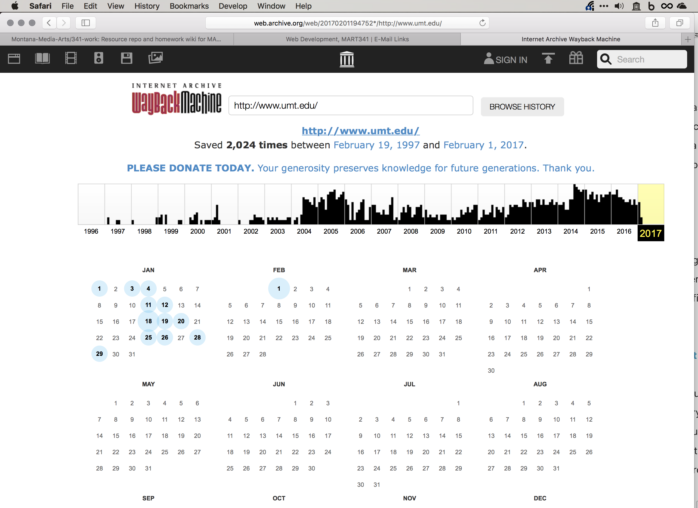
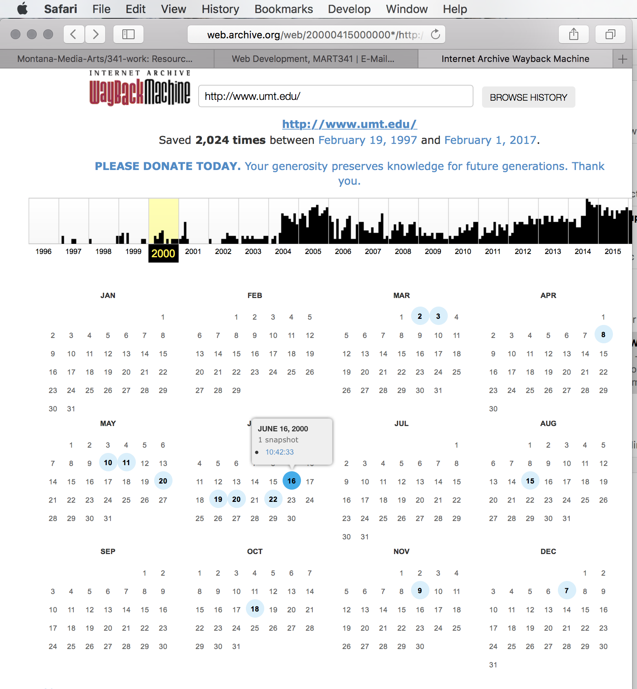
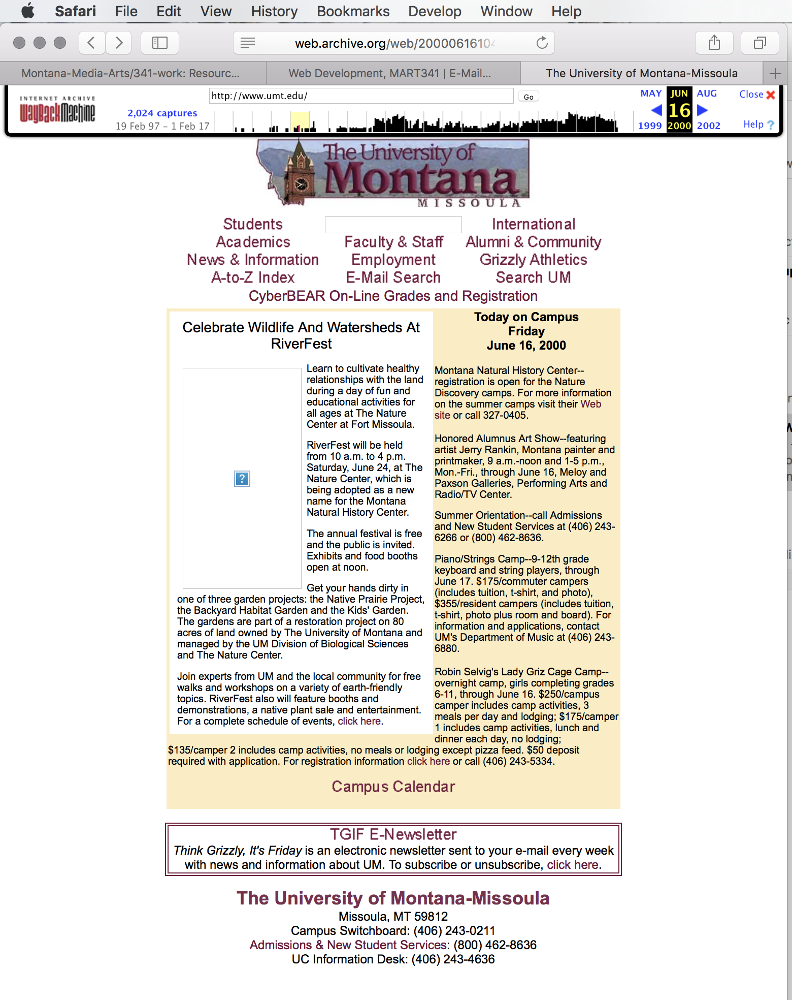

<a href="https://archive.org/web/" target="_blank">The Wayback Machine</a> allows you to see what certain websites looked like at different points in history. This may not be the best resource for learning how to code a website, but it does allow you to get a sense for how a company may have viewed their brand over time, how the web used to look, or retrieve information from the past that is no longer live. It's also the coolest way to spend a Saturday night.

<ul class="nav nav-tabs">
  <li class="active"><a href="#step1" data-toggle="tab">Step 1</a></li>
  <li><a href="#step2" data-toggle="tab">Step 2</a></li>
  <li><a href="#step3" data-toggle="tab">Step 3</a></li>
</ul>

  

  The resource is the Internet Archives [Wayback Machine](https://archive.org). For example, let's look at [the history of www.umt.edu](http://web.archive.org/web/20170201194752*/http://www.umt.edu/).
    
At the moment I took this picture, the page tells us, there have been 2024 snapshots taken of this site since the Internet archive began, dating from Feb. 19, 1997 to Feb. 01, 2017.

    
  

  

    
I am going to select the year 2000, and the date June 16th, 2000.

    
  

  

    
That shows us what the <a href="http://web.archive.org/web/20000616104233/http://www.umt.edu/" target="_blank">University of Montana’s main site looked like at that moment in history</a>. Definitely has a retro feel now, especially with that logo graphic.

    
  

## Examples

  

    

      

        <a href="https://web.archive.org/web/19971023010656/http://www3.whitehouse.gov:80/" target="_blank" class="list-group-item">
          
          <h4 class="list-group-item-heading">whitehouse.gov from Oct. 23, 1997</h4>
          

          
<i class="fas fa-link" aria-hidden="true"></i> External Site

        </a>
      

    

  

  

    

      

        <a href="https://web.archive.org/web/19961121230155/http://nytimes.com/" target="_blank" class="list-group-item">
          
          <h4 class="list-group-item-heading">The New York Times from Nov. 21, 1996</h4>
          

          
<i class="fas fa-link" aria-hidden="true"></i> External Site

        </a>
      

    

  

  

    

      

        <a href="http://web.archive.org/web/19961222031059/http://www.mtv.com/" target="_blank" class="list-group-item">
          
          <h4 class="list-group-item-heading">MTV from Dec. 22, 1996</h4>
          

          
<i class="fas fa-link" aria-hidden="true"></i> External Site

        </a>
      

    

  

