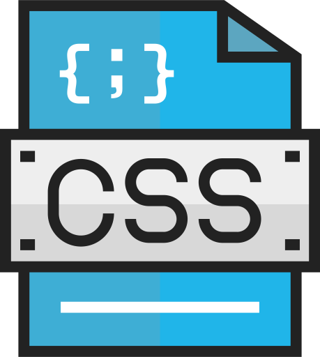

  
  <h2 style="text-align: center;">12://CSS Website</h2>

Now that you've had some practice with using CSS, let's apply it to building sites filled with pages that look and fuction with a cohesive theme.

For this site, use your knowledge of CSS to create a 4-page magazine, newspaper, or blog layout. These are sites that showcase time-dependent written content first-and-foremost, and are one of the most utilized site types on the web.

Think of a written material you read on a regular basis - a newspaper, tech blog, recipe repository, or entertainment magazine for example - and begin brainstorming how you could translate it to you own site. This site should showcase:
1. Your understanding of color.
2. Well-selected and well-paired fonts.
2. Creative use of typography principles.
4. Use of positioning text, media, and layout elements.
5. Clean, legible coding.

By the end of this Topic, we hope you:
<ul class="pros-and-cons">
  <li class="icon-pro">Have a self-made 4+ page site.</li>
  <li class="icon-pro">Showcase an understanding of CSS as a styling language.</li>
  <li class="icon-pro">Explored building a site based off of a theme, which is reflected across all its content.</li>
</ul>
